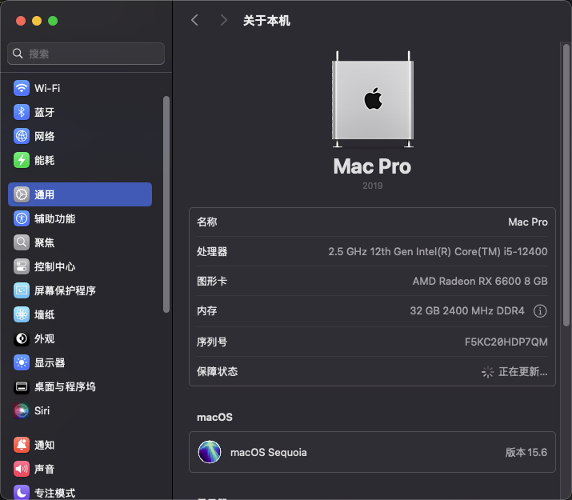

# OpenCore EFI for ASRock B660M-ITX/ac + i5-12400 + RX6600

本仓库分享适用于 **华擎 ASRock B660M-ITX/ac 主板** 的黑苹果 OpenCore EFI 配置文件，方便拥有相同或相似硬件的小伙伴快速安装 macOS。

> ⚠️ 本 EFI 仅供学习与研究使用，请勿用于商业用途。使用前请先自行备份原有数据与 EFI。

---

## 🖥️ 硬件配置

| 硬件 | 型号                                   |
|------|--------------------------------------|
| 主板 | ASRock B660M-ITX/ac                  |
| CPU  | Intel Core i5-12400 (Alder Lake)     |
| 核显 | Intel UHD 730 (已禁用)                  |
| 独显 | AMD Radeon RX 6600 (原生支持)            |
| 内存 | 金士顿 DDR4 32GB (2x16GB)               |
| 硬盘 | 西数黑盘 SN770 1TB                       |
| 网卡 | Intel Wireless AC 9462 and Bluetooth |



---

## ✨ EFI 特性

- 引导器：OpenCore `1.0.5`
- 支持系统：macOS **Sequoia 15.x**、macOS **Sonoma 14.x**
- 核显禁用，仅使用 **RX6600** 作为主力显卡
- 原生支持 **睡眠 / 唤醒 / USB 映射 / 声卡 / 有线网络**
- 支持 **iServices (iMessage, FaceTime, App Store)**
- BIOS 设置优化，安装过程稳定

---

## ✅ 已驱动功能

- [x] CPU / 内存 / 睿频正常
- [x] RX6600 原生免驱，支持 Metal 3
- [x] 声卡：ALC897 (通过 `alcid=xx` 注入)
- [x] 有线网卡：Intel I219V 正常
- [x] USB：定制 USBPorts，Type-A/Type-C 全部可用
- [x] 睡眠与唤醒：正常
- [x] NVRAM：持久化正常

---

## ⚠️ 暂未解决 / 需注意
- [ ] 系统内置无线WIFI功能（目前的WIFI方案使用 `itlwm` + `HeliPort`）

---

## 🔧 BIOS 设置 (必看)

进入 BIOS (`F2` 键)，建议加载 **默认设置 (Load UEFI Defaults)** 后，修改以下选项：

### Advanced → Chipset Configuration
- [x] Primary Graphics Adapter → **PCIE1**
- [x] VT-d → **Disabled** (如需开启需搭配 `DisableIoMapper`)
- [x] iGPU Multi-Monitor → **Disabled** （禁用核显）
- [x] Deep Sleep → **Enabled in S4-S5**

### Advanced → ACPI Configuration
- [x] PCIE Devices Power On → **Enabled**
- [x] I219 LAN Power On → **Disabled**

### Advanced → USB Configuration
- [x] XHCI Hand-off → **Enabled**

### Security
- [x] Secure Boot → **Disabled**

### Boot
- [x] Boot From Onboard LAN → **Enabled**

---

## 📦 使用方法

### 1、克隆或下载本仓库
```bash
git clone https://github.com/TalkMu/OpenCore-ASRock-B660m-ITX-AC.git
```

### 2、将 **EFI** 文件夹拷贝到启动盘的 **EFI** 分区

### 3、使用 **ProperTree** 或 **OCAuxiliaryTools** 修改以下信息：
- `PlatformInfo -> Generic` 内的 `SerialNumber`、`MLB`、`SystemUUID`
- SMBIOS 建议使用 `MacPro7,1`

### 4、按照上述 **BIOS 设置** 调整 **BIOS**

### 5、引导安装 **macOS**